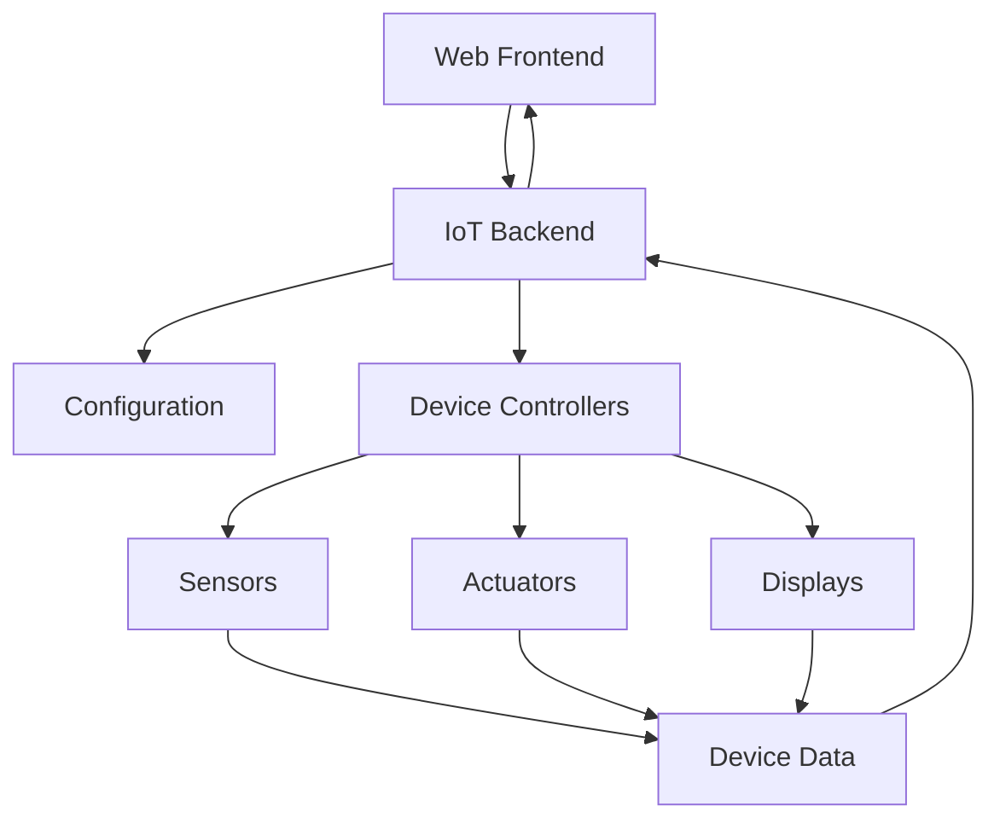
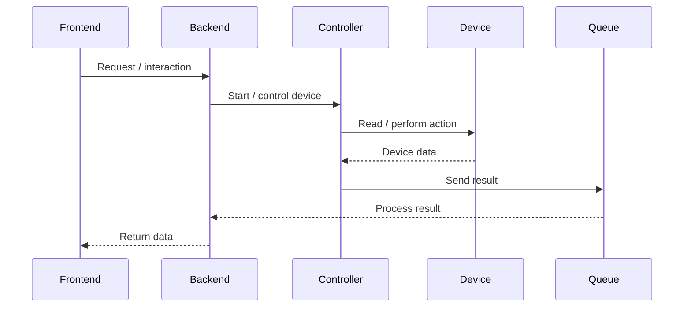

# IoT System

A full-stack IoT system built with Python, Raspberry Pi and a web-based frontend for monitoring and interacting with connected sensors and actuators.

The system combines a Raspberry Pi-based backend responsible for communicating with physical devices with a frontend application that provides a user interface for interacting with the IoT platform.

## Architecture

The application consists of two main parts: the **IoT backend** running on Raspberry Pi devices and the **frontend** used to interact with the system.



The backend dynamically loads the configuration of each Raspberry Pi and starts the appropriate controllers for its connected devices.

## Backend

The backend is implemented in Python and designed to run on Raspberry Pi.

It provides a modular architecture where individual sensors and actuators are handled by dedicated controllers. Multiple devices can run concurrently using threads and communicate through queues.

### Supported Devices

The project contains controllers and components for different types of IoT devices, including:

* DHT
* DMS
* Distance sensors
* Ultrasonic sensors
* PIR
* Buttons
* GSG
* LCD
* SD card
* Infrared
* RGB
* Other Raspberry Pi peripherals

The devices assigned to each Raspberry Pi are defined through the project configuration.

## Frontend

The frontend provides the user interface for interacting with the IoT system.

It communicates with the backend and allows users to monitor device information and interact with connected IoT components.

The frontend is included in this repository as part of the complete application.

## Device Communication

The backend uses a queue-based architecture to handle communication between individual device controllers and the main application.



This allows individual devices to operate independently while the main application coordinates their execution.

## Running the Backend

The Raspberry Pi application can be started by providing the Raspberry Pi number:

```bash
python3 main.py [PI_NUMBER]
```

For example:

```bash
python3 main.py 1
```

The application loads the configuration for the selected Raspberry Pi and starts the corresponding device controllers.

## My Contribution

As part of the project team, I contributed to the development of the full-stack IoT system, working across both the Raspberry Pi backend and the frontend application.

My work included contributing to the system architecture, implementing and integrating IoT components, working with sensors and actuators, and connecting the frontend with the backend functionality.

